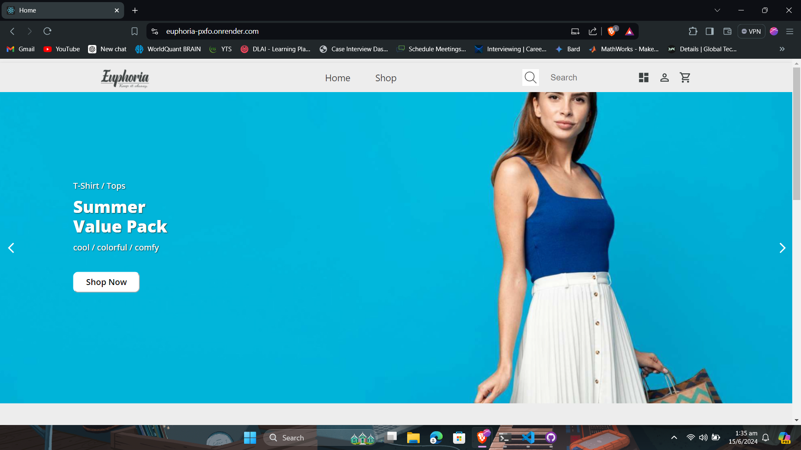
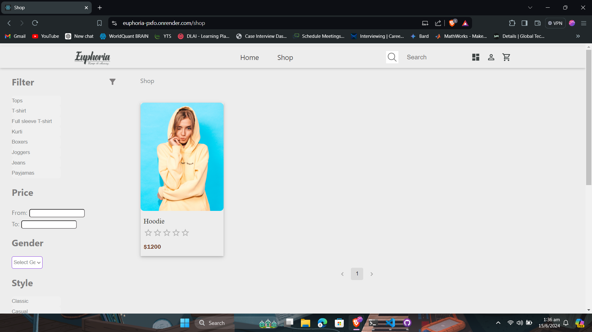
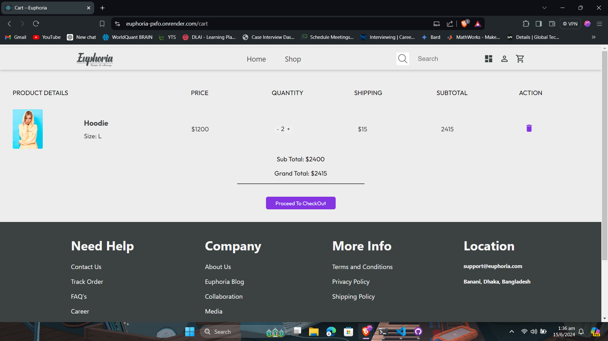
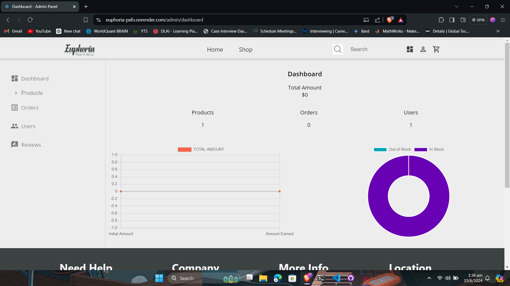

# MERN E-COMMERCE APP

# Project Description

A full-stack e-commerce application built with the MERN stack. This app allows users to browse products, add items to the cart, and make purchases. It also includes an admin panel for managing products and orders.

## Table of Contents
- [Installation](#installation)
- [Usage](#usage)
- [Features](#features)
- [Screenshots](#screenshots)
- [Tech Stack](#tech-stack)
- [Contributing](#contributing)
- [License](#license)
- [Contact Information](#contact-information)

## Installation

    1. Clone the repository:
   ```sh
   git clone https://github.com/yourusername/mern-ecommerce-app.git
```
    2. Navigate to the project directory:

    cd mern-ecommerce-app

    3. Install server dependencies:

    cd backend
    npm install 

    4. Open a new terminal and Install client dependencies:


    cd client
    npm install
 

    5. Set up environment variables:

    PORT

    NODE_ENV

    MONGODB_URI

    JWT_SECRET

    JWT_EXPIRE

    COOKIE_EXPIRE

    SMTP_HOST

    SMTP_PORT

    SMTP_SERVICE

    SMTP_MAIL

    SMTP_PASSWORD

    CLOUDINARY_NAME

    CLOUDINARY_API_KEY

    CLOUDINARY_API_SECRET

    STRIPE_API_KEY

    STRIPE_SECRET_KEY


    6. Start the development server:

    npm backend/server.js


## Features
    1. User authentication and authorization
    2. Product listing and detail pages
    3. Shopping cart, checkout and payment process,
    4. Order history and order management
    5. Admin panel for product and order management
    6. Responsive design

## Screenshots





## Tech Stack
### Frontend
    1. React
    2. Redux
    3. Material UI
### Backend
    1. Node.js
    2. Express.js
    3. MongoDB


## Contributing
Contributions are welcome! If you have suggestions for improvements, feel free to fork the repo and create a pull request. You can also open an issue with the tag "enhancement".

To contribute:

    1. Fork the Project
    2. Create your Feature Branch (`git checkout -b feature/YourFeatureName`)
    3. Commit your Changes (`git commit -m 'Add YourFeatureName'`)
    4. Push to the Branch (`git push origin feature/YourFeatureName`)
    5. Open a Pull Request


## License
This project is licensed under the MIT License - see the [LICENSE](LICENSE) file for details.

## Contact Information

    Email: atiqishrak7@gmail.com
    LinkedIn: https://www.linkedin.com/in/atiq-ishrak-744a69229/

